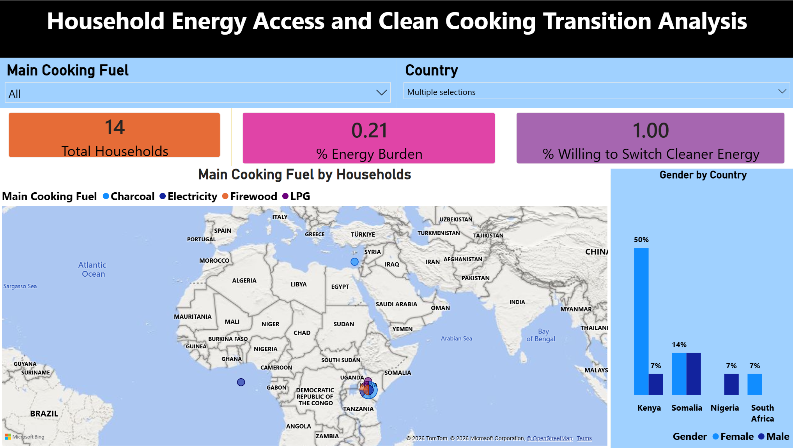
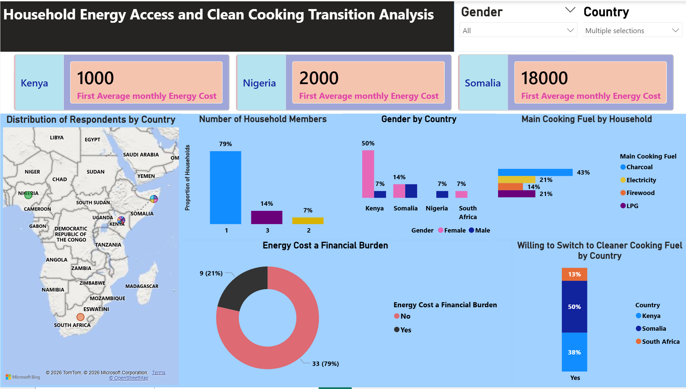

**Household Energy Access and Clean Cooking Transition Analysis**

**Project Overview**

This project provides a comprehensive data-driven analysis of household energy consumption patterns across selected African nations, specifically Kenya, Nigeria, Somalia, and South Africa. The dashboard is designed to visualize the financial burden of energy costs and the readiness of households to transition to cleaner cooking alternatives like LPG and Electricity.
Key Visualizations and Insights

**1. Market Segmentation**

The dashboard segments households based on several critical factors:

•	Geographic Distribution: Mapping respondents across East, West, and Southern Africa.

•	Demographics: Analysis of household size, showing a majority of one-member households at 79%, and gender distribution, such as 50% female representation in Kenya.

•	Current Energy Mix: Identifying the primary cooking fuels used, including Charcoal (43%), Firewood, LPG, and Electricity.

**2. Financial Burden Analysis**

•	Monthly Energy Cost: Comparative view of average costs across countries, such as 18,000 in Somalia compared to 1,000 in Kenya.

•	Energy Burden Perception: A donut chart showing that 21% of respondents view energy costs as a significant financial burden.

**3. Targeting for Transition**

The "Willingness to Switch" visualization is a key targeting tool for policy makers:

•	Somalia shows the highest willingness to switch at 50%.

•	Kenya follows with 38% willingness.

•	South Africa shows 13% readiness.

**Technical Stack**

•	**Data Collection**: KoboToolbox

•	**Data Modeling**: Power BI

•	**Visualization**: Power BI with Map integration (Bing and TomTom)

**How to Use the Dashboard**
1.	Filter by Fuel: Use the "Main Cooking Fuel" slicer to see how different users, such as those using Charcoal or LPG, perceive costs.

2.	Filter by Country: Use the "Country" dropdown to isolate specific market dynamics in Nigeria or Somalia.

3.	Gender Analysis: Toggle gender filters to see how energy burden affects female-headed versus male-headed households differently.

